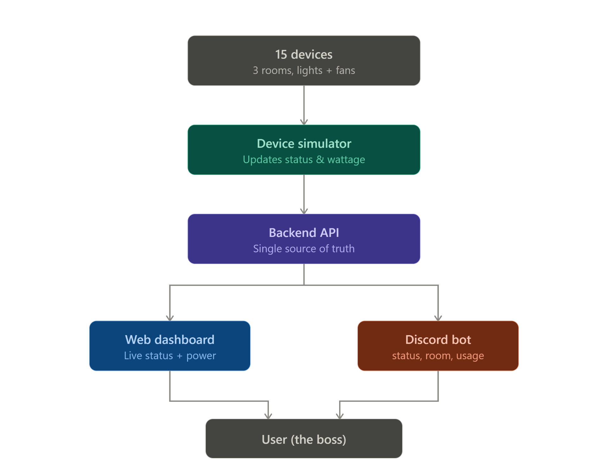

# Office Power Monitor

Live dashboard + Discord bot for tracking every light and fan in a 3‑room office. Both interfaces share **one backend** (Lovable Cloud / Postgres) as the single source of truth.

## What's here

- **Web dashboard** at `/` — real-time device states on a top-view office layout, per-room power/kWh, active alerts, editable settings.
- **Discord bot** at `POST /api/public/discord` — slash commands `/status`, `/room name:<slug>`, `/usage`. Uses Lovable AI Gateway (Gemini 3 Flash) to humanize replies.
- **Simulator** at `POST /api/public/tick` — called every minute by pg_cron. Toggles devices, accumulates Wh, and raises/resolves alerts.

## Architecture



High-level flow: **15 simulated devices → device simulator (pg_cron tick) → backend API + Postgres (single source of truth) → web dashboard + Discord bot → user**.

See `docs/system-architecture.md` for a block-by-block walkthrough and `docs/hardware-schematic.md` for the ESP32 wiring.

## Setup

### Local demo mode (works without Supabase)

The app now runs in a fully local demo mode if the Supabase secrets are absent. The same backend module powers both the dashboard and the bot, and the simulator evolves the 15 devices in memory every minute.

```bash
npm install
npm run dev
```

Then open the app and test:
- Dashboard: `/`
- Tick endpoint: `/api/public/tick`
- Discord demo endpoint: `/api/public/discord`

### Discord bot (optional)

1. Cloud is already enabled — schema, seed data, and pg_cron job are installed via migration.
2. Add these secrets in Cloud → Secrets (only needed for the Discord bot):
   - `DISCORD_PUBLIC_KEY` — from your Discord app's General Information page.
   - `DISCORD_APPLICATION_ID` — same page.
   - `DISCORD_BOT_TOKEN` — Bot page. **Only needed to run the command-registration script**; it isn't used at runtime.
   - `DISCORD_ALERT_WEBHOOK_URL` *(optional)* — a webhook URL for a channel where the simulator should post proactive alerts.
3. Register slash commands once:
   ```bash
   DISCORD_APPLICATION_ID=... DISCORD_BOT_TOKEN=... bun run scripts/register-discord-commands.ts
   ```
4. In the Discord Developer Portal, set **Interactions Endpoint URL** to:
   ```
   https://<your-published-app>.lovable.app/api/public/discord
   ```
   Discord will send a PING to verify — the endpoint responds automatically.

## Dummy data

Seeded via migration exactly as required: 3 rooms × (2 fans + 3 lights) = 15 devices. Fans 60W, lights 15W. State evolves every minute via the simulator.

## Notes on scope

- No physical hardware: `docs/hardware-schematic.md` documents the pin mapping and electrical reasoning to build the Wokwi/Tinkercad circuit yourself.
- kWh is estimated from `Σ (watts × on-time)`, bucketed per hour.
- Alert thresholds are configurable from the dashboard's Settings drawer.
